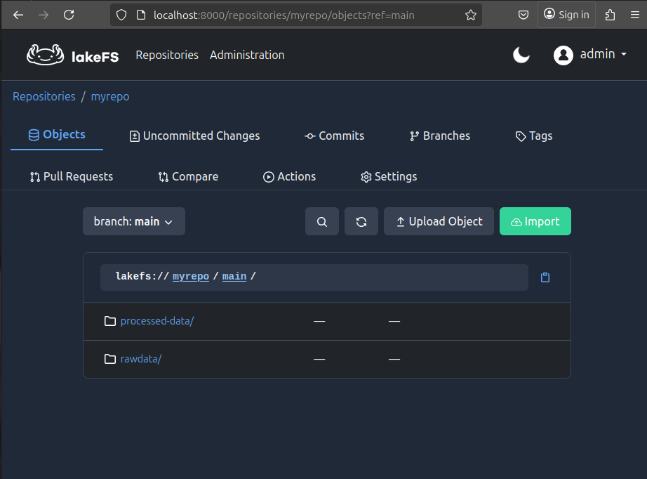

# Hướng dẫn khởi động và tương tác hệ thống

## 1. Khởi động hệ thống cơ bản

**Thành phần:**

* **lakeFS**: Quản lý phiên bản dữ liệu
* **PostgreSQL**: Lưu metadata cho lakeFS
* **MinIO**: Object store tương thích S3

**Bước thực hiện:**

```bash
sudo systemctl stop postgresql  # Tắt PostgreSQL nếu đang chiếm cổng 5432
docker compose up -d           # Khởi chạy các container
```

---

## 2. Tương tác qua CLI

### 2.1. Dùng `mc` (MinIO Client)

```bash
docker compose exec -it mc sh  # Vào container mc
exit                            # Thoát
```

**Thêm alias:**

```bash
mc alias set myminio http://minio:9000 admin Admin12345
```

**Lệnh cơ bản:**

```bash
mc alias list                               # Kiểm tra alias
mc alias remove myminio                    # Xóa alias (nếu sai)
mc mb myminio/mybucket                     # Tạo bucket
mc ls myminio                              # Liệt kê bucket
mc ls myminio/mybucket                     # Liệt kê file trong bucket
mc cp /data/file.csv myminio/mybucket      # Upload file
```

> ✨ **Thư mục `/data` trong container `mc` đã được mount từ `data/` host.**

---

### 2.2. Dùng `lakectl` (CLI lakeFS)

```bash
docker compose exec -it lakefs sh   # Vào container lakefs
lakectl --help                      # Hướng dẫn
exit                                # Thoát
```

> 🔹 File `lakectl.yaml` đã được mount sẵn, không cần đặt tay config.

---

## 3. Tương tác với lakeFS

### Tạo repo:

```bash
lakectl repo create lakefs://myrepo s3://mybucket
```

### Xóa repo:

```bash
lakectl repo delete lakefs://myrepo
```

### Xem dữ liệu trong nhánh:

```bash
lakectl fs ls lakefs://myrepo/main/
```

### Upload file:

```bash
lakectl fs upload --source /upload/students.csv lakefs://myrepo/main/students.csv
```

### Upload cả folder:

```bash
lakectl fs upload --recursive --source /upload/ lakefs://myrepo/main/rawdata/
```

!\[upload files]\(images/upload files.png)

### Xóa file / thư mục:

```bash
lakectl fs rm lakefs://myrepo/main/students.csv
lakectl fs rm --recursive lakefs://myrepo/main/rawdata/
```

### Commit thay đổi:

```bash
lakectl commit lakefs://myrepo/dev -m "upd"
```

!\[branch commit]\(images/branch commit.png)

### Nhánh (branch):

```bash
lakectl branch create lakefs://myrepo/dev --source lakefs://myrepo/main
```

!\[create new branch]\(images/create new branch.png)

### Tạo thư mục bằng upload file:

```bash
echo "ghi chu" > issue.txt
lakectl fs upload --source issue.txt lakefs://myrepo/dev/processed-data/issue.txt
```

### Reset thay đổi chưa commit:

```bash
lakectl branch reset lakefs://myrepo/dev
```

### Rollback commit:

```bash
lakectl branch revert lakefs://myrepo/main <commit-id>
```

### Kiểm tra commit hiện tại:

```bash
lakectl branch show lakefs://myrepo/main
```

### So sánh và merge:

```bash
lakectl diff lakefs://myrepo/dev
lakectl merge lakefs://myrepo/dev lakefs://myrepo/main
```



---

## 4. Kết nối Apache Spark

Spark đọc ghi dữ liệu từ lakeFS thông qua connector `hadoop-lakefs`, tương thích với giao thức `lakefs://`.

> ✅ Tất cả cấu hình đã được đặt trong `docker-compose.yml`

### 🔧 Cấu hình quan trọng:

**Data plane (`s3a://`) – đi qua MinIO:**

```env
fs.s3a.endpoint=http://minio:9000
fs.s3a.path.style.access=true
fs.s3a.access.key=${MINIO_ROOT_USER}
fs.s3a.secret.key=${MINIO_ROOT_PASSWORD}
fs.s3a.connection.ssl.enabled=false
```

**Metadata plane (`lakefs://`) – xử lý version:**

```env
fs.lakefs.impl=io.lakefs.LakeFSFileSystem
fs.lakefs.endpoint=http://lakefs:8000/api/v1
fs.lakefs.access.key=${LAKEFS_ACCESS_KEY}
fs.lakefs.secret.key=${LAKEFS_SECRET_KEY}
```

### 📁 Mount thư viện và jobs:

* `./jobs:/opt/bitnami/spark/jobs:ro`: mount script xử lý như `vdt1.py`, `vdt2.py`, `vdt3.py`
* `./jars/io-lakefs-hadoop-lakefs-assembly-0.2.5.jar`: connector hỗ trợ `lakefs://`

---

## 5. Xử lý với Spark

### 🧪 Ví dụ: `jobs/vdt1.py`

```python
# VDT'25 coding test Q1
# Nội dung yêu cầu:

#     Lấy danh sách khóa học bạn đăng ký tham gia (theo tên hoặc email)
#     Schema bảng đầu ra gồm: full_name, mail, course_title, platform, start_date, end_date
#     Định dạng trường date: yyyyMMdd

# Yêu cầu đầu ra:

#     Lưu file output với định dạng csv không có header, phân cách trường bằng dấu phẩy ( , )
#     File output có tên 'result_p1_1'
#--------------------------------------------
from pyspark.sql import SparkSession
from pyspark.sql.types import *
from pyspark.sql.functions import *
import os

# khoi tao SparkSession
spark = SparkSession.builder\
        .appName("lakeFS pySpark processing")\
        .config("spark.hadoop.fs.s3a.endpoint", "http://minio:9000")\
        .config("spark.hadoop.fs.s3a.path.style.access", "true")\
        .config("spark.hadoop.fs.s3a.access.key", os.getenv("MINIO_ROOT_USER"))\
        .config("spark.hadoop.fs.s3a.secret.key", os.getenv("MINIO_ROOT_PASSWORD"))\
        .config("spark.hadoop.fs.lakefs.impl", "io.lakefs.LakeFSFileSystem")\
        .config("spark.hadoop.fs.lakefs.endpoint", "http://lakefs:8000/api/v1")\
        .config("spark.hadoop.fs.lakefs.access.key", os.getenv("LAKEFS_ACCESS_KEY"))\
        .config("spark.hadoop.fs.lakefs.secret.key", os.getenv("LAKEFS_SECRET_KEY"))\
        .getOrCreate()

# doc du lieu tho tu thu muc rawdata cua nhanh dev
df_students = spark.read\
                .option("header", True)\
                .option("inferSchema", True)\
                .csv("lakefs://myrepo/dev/rawdata/students.csv")

df_learning_courses = spark.read\
                .orc("lakefs://myrepo/dev/rawdata/learning_courses.orc")

# xu ly du lieu
result1 = df_students.join(df_learning_courses, df_students['student_id'] == df_learning_courses['student_id'])
result1 = result1.select('full_name', 'mail', 'course_title', 'platform', 'start_date', 'end_date')

# ghi du lieu da xu ly ra thu muc processed-data cua nhanh dev
result1.write.mode('overwrite')\
    .format('csv').option('header', False)\
    .save("lakefs://myrepo/dev/processed-data/result_p1_1.csv")
```

### ⚙️ Chạy job:

```bash
docker compose exec spark-master spark-submit \
  --master spark://spark-master:7077 \
  --packages io.lakefs:hadoop-lakefs-assembly:0.2.5 \
  /opt/bitnami/spark/jobs/vdt1.py
```

!\[kết quả spark]\(images/spark result.png)

> ✨ Tương tự với `jobs/vdt2.py` nếu có logic khác (ví dụ aggregate, join, etc.)

---

## 6. Delta Lake

Spark hỗ trợ Delta format nếu thêm thư viện tương ứng:

### Phụ thuộc:

```bash
--packages io.delta:delta-core_2.12:2.4.0
```

### Tạo SparkSession:

```python
spark = SparkSession.builder \
    .appName("DeltaLake Integration") \
    .config("spark.sql.extensions", "io.delta.sql.DeltaSparkSessionExtension") \
    .config("spark.sql.catalog.spark_catalog", "org.apache.spark.sql.delta.catalog.DeltaCatalog") \
    .getOrCreate()
```

### Ghi và đọc:

```python
df.write.format("delta").save("s3a://mybucket/delta-table")
delta_df = spark.read.format("delta").load("s3a://mybucket/delta-table")
```

### Time travel:

```python
spark.read.format("delta").option("versionAsOf", 0).load("s3a://mybucket/delta-table")
```

---

## Cấu trúc dự án

```text
demo/
├── data/               # Dữ liệu upload
├── docker-compose.yml
├── .env                # Thông tin credentials
├── lakectl.yaml        # Cấu hình CLI lakectl
├── jobs/               # Thư mục chứa file xử lý Spark
│   ├── vdt1.py
|   ├── vdt2.py
│   └── vdt3.py
├── images/             # Ảnh minh hoạ
└── README.md           # Hướng dẫn hệ thống
```

---